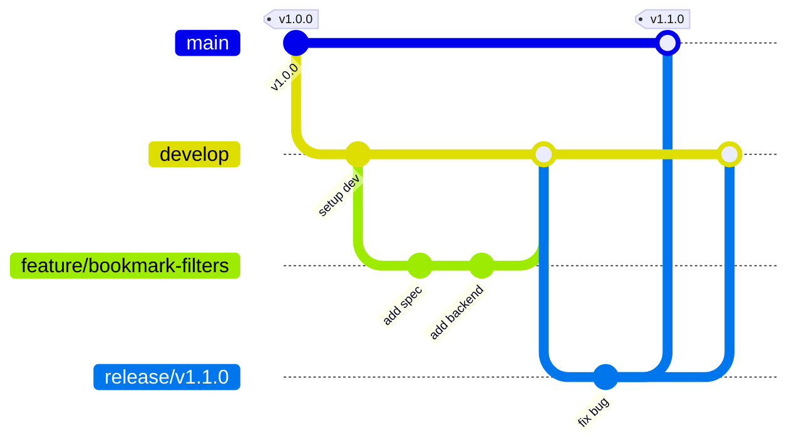

# Release Manager Skill

Use this skill when planning new version milestones, organizing feature backlogs into releases, staging release branches, or tagging production builds.

## 1. Semantic Versioning (SemVer)
We follow the semantic versioning standard `vX.Y.Z`:
- **MAJOR (`X`)**: Breaking architectural changes, incompatible API modifications, or absolute system rewrites.
- **MINOR (`Y`)**: Adding major features or backward-compatible API improvements (e.g., adding filter bookmarking).
- **PATCH (`Z`)**: Backward-compatible bug fixes, styling adjustments, or minor documentation updates.

## 2. Git Branching Strategy
All work in this repository is structured under the Git Flow branching model:



### Branch Roles
1. **`master` / `main`**:
   - Represents production-stable code.
   - Every commit on master must be tagged with a version (e.g., `v1.0.0`).
2. **`develop`**:
   - Represents the primary integration branch for development.
   - All completed features merge here.
3. **`feature/[feature-name]`**:
   - Branches off `develop`.
   - Dedicated to a single feature spec.
   - Merges back into `develop` once verified by QA.
4. **`release/v[X.Y.Z]`**:
   - Branches off `develop` when all release features are integrated.
   - Used for stabilization, final manual testing, and documentation alignment.
   - Merges to `master` and `develop` when approved.

## 3. Release Process Checklist
When executing a release:
- Create a release branch off `develop`:
  ```bash
  git checkout develop
  git pull origin develop
  git checkout -b release/vX.Y.Z
  ```
- Build & test locally:
  ```bash
  bash scripts/run_tests.sh
  ```
- Merge to `master` and tag:
  ```bash
  git checkout master
  git merge --no-ff release/vX.Y.Z
  git tag -a vX.Y.Z -m "Release vX.Y.Z"
  ```
- Merge back to `develop` to sync bug fixes:
  ```bash
  git checkout develop
  git merge --no-ff release/vX.Y.Z
  ```
- Push branches and tags:
  ```bash
  git push origin master develop --tags
  ```
- Delete the release branch.
