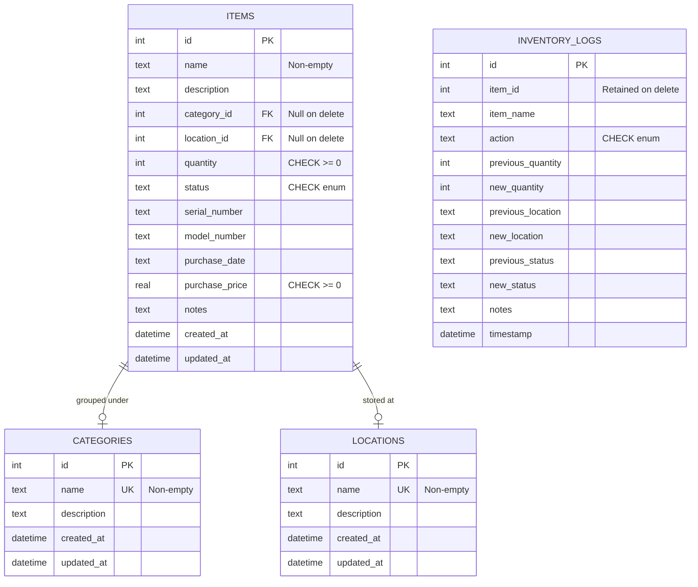

# Database Schema & Data Model Design

The Inventory Management System uses a localized **SQLite** database (`inventory.db`) with strict data constraints and automated audit logging. This document outlines the tables, field validations, relationships, triggers, and logging design.

---

## 1. Schema Diagram & Relationships



---

## 2. Table Definitions

### 2.1 Categories (`categories`)
Groups items of similar characteristics.
- `id` (INTEGER, PRIMARY KEY, AUTOINCREMENT)
- `name` (TEXT, UNIQUE, NOT NULL): Checked to ensure it is not empty or whitespace-only (`CHECK(length(trim(name)) > 0)`).
- `description` (TEXT, OPTIONAL)
- `created_at` (DATETIME, DEFAULT `CURRENT_TIMESTAMP`)
- `updated_at` (DATETIME, DEFAULT `CURRENT_TIMESTAMP`)

### 2.2 Locations (`locations`)
Tracks physical storage sections.
- `id` (INTEGER, PRIMARY KEY, AUTOINCREMENT)
- `name` (TEXT, UNIQUE, NOT NULL): Checked to ensure it is not empty or whitespace-only (`CHECK(length(trim(name)) > 0)`).
- `description` (TEXT, OPTIONAL)
- `created_at` (DATETIME, DEFAULT `CURRENT_TIMESTAMP`)
- `updated_at` (DATETIME, DEFAULT `CURRENT_TIMESTAMP`)

### 2.3 Items (`items`)
Primary inventory records.
- `id` (INTEGER, PRIMARY KEY, AUTOINCREMENT)
- `name` (TEXT, NOT NULL): Checked to ensure it is not empty or whitespace-only (`CHECK(length(trim(name)) > 0)`).
- `description` (TEXT, OPTIONAL)
- `category_id` (INTEGER, FOREIGN KEY): References `categories(id)`. Triggers `ON DELETE SET NULL` to avoid orphaned items.
- `location_id` (INTEGER, FOREIGN KEY): References `locations(id)`. Triggers `ON DELETE SET NULL` to avoid orphaned items.
- `quantity` (INTEGER, NOT NULL, DEFAULT 1): Must be non-negative (`CHECK(quantity >= 0)`).
- `status` (TEXT, NOT NULL, DEFAULT `'in_stock'`): Constrained to enum values (`CHECK(status IN ('in_stock', 'low_stock', 'out_of_stock', 'borrowed', 'lost'))`).
- `serial_number` (TEXT, OPTIONAL)
- `model_number` (TEXT, OPTIONAL)
- `purchase_date` (TEXT, OPTIONAL): Stored as ISO8601 string (`YYYY-MM-DD`).
- `purchase_price` (REAL, OPTIONAL): Must be non-negative (`CHECK(purchase_price IS NULL OR purchase_price >= 0)`).
- `notes` (TEXT, OPTIONAL)
- `created_at` (DATETIME, DEFAULT `CURRENT_TIMESTAMP`)
- `updated_at` (DATETIME, DEFAULT `CURRENT_TIMESTAMP`)

### 2.4 Inventory Logs (`inventory_logs`)
Maintains an immutable historical audit trail of all transactions and changes.
- `id` (INTEGER, PRIMARY KEY, AUTOINCREMENT)
- `item_id` (INTEGER): Retained as a reference even if the parent item is deleted.
- `item_name` (TEXT, NOT NULL): Recorded directly to ensure the log description remains readable even after item deletion.
- `action` (TEXT, NOT NULL): Constrained to enum actions (`CHECK(action IN ('create', 'update_quantity', 'update_location', 'update_status', 'delete', 'check_out', 'check_in', 'update_details'))`).
- `previous_quantity` (INTEGER, OPTIONAL)
- `new_quantity` (INTEGER, OPTIONAL)
- `previous_location` (TEXT, OPTIONAL): Location name recorded directly as TEXT so deletions of locations do not corrupt logs.
- `new_location` (TEXT, OPTIONAL)
- `previous_status` (TEXT, OPTIONAL)
- `new_status` (TEXT, OPTIONAL)
- `notes` (TEXT, OPTIONAL)
- `timestamp` (DATETIME, DEFAULT `CURRENT_TIMESTAMP`)

---

## 3. Strict SQL Constraints

To ensure no agentic prompt-drift or developer errors degrade the data, the database configuration enforces:
1. **Foreign Keys Constraint**: Enforced at database connection instantiation in Python:
   ```python
   conn.execute("PRAGMA foreign_keys = ON;")
   ```
2. **Empty Strings Check**: Empty whitespace input is rejected on the database level:
   ```sql
   CHECK(length(trim(name)) > 0)
   ```
3. **Values Range Checks**: Negative stock and negative pricing values are rejected:
   ```sql
   CHECK(quantity >= 0)
   CHECK(purchase_price IS NULL OR purchase_price >= 0)
   ```

---

## 4. Database Triggers

For automatic tracking of modifications, SQLite triggers update the `updated_at` column whenever a row is modified:

```sql
CREATE TRIGGER IF NOT EXISTS update_categories_timestamp 
AFTER UPDATE ON categories
FOR EACH ROW
BEGIN
    UPDATE categories SET updated_at = CURRENT_TIMESTAMP WHERE id = OLD.id;
END;

CREATE TRIGGER IF NOT EXISTS update_locations_timestamp 
AFTER UPDATE ON locations
FOR EACH ROW
BEGIN
    UPDATE locations SET updated_at = CURRENT_TIMESTAMP WHERE id = OLD.id;
END;

CREATE TRIGGER IF NOT EXISTS update_items_timestamp 
AFTER UPDATE ON items
FOR EACH ROW
BEGIN
    UPDATE items SET updated_at = CURRENT_TIMESTAMP WHERE id = OLD.id;
END;
```

---

## 5. Audit Logging Flow

Whenever an item is updated or deleted in `main.py`, the backend compares the state before and after saving the changes:
- If `quantity` changes: Writes an audit log with action `'update_quantity'` tracking the numeric offset.
- If `location_id` changes: Looks up the location names and writes an audit log with action `'update_location'`.
- If `status` changes: Compares state. If status goes from `'in_stock'` to `'borrowed'`/`'lost'`, it logs a `'check_out'` transaction. If it returns back, it logs a `'check_in'`.
- General detail edits (name, notes, serials) are logged with action `'update_details'`.
- Deletion logs write action `'delete'`.
